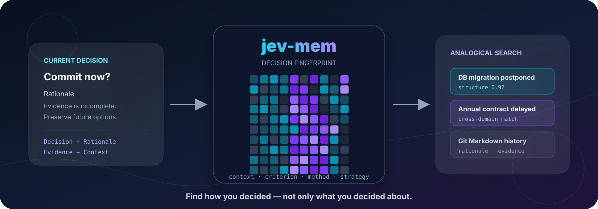
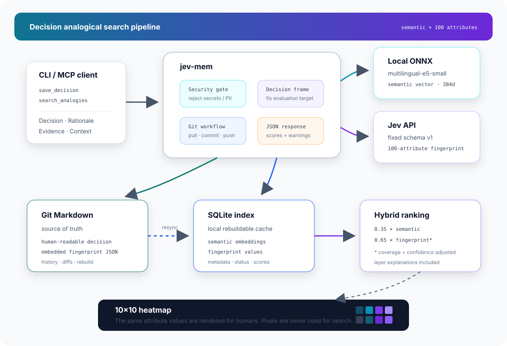

# jev-mem

**過去の意思決定を、話題ではなく「判断構造」で探すためのGit-backed memory。**

`jev-mem` records decisions together with their rationale, evidence, context, and a fixed 100-attribute fingerprint. It combines conventional semantic search with structural similarity search so that analogous decisions can be found across unrelated domains.

<p align="center">
  
</p>

<p align="center">
  <a href="https://github.com/tomohiro-owada/jev-mem/actions/workflows/ci.yml"></a>
  
  
  
  
  
</p>

## 何を解決するか

通常のsemantic searchは「何について書かれているか」を探すのが得意です。

```text
PostgreSQLを採用する
  → Database / MySQL / Storage / Architecture に近い
```

`jev-mem`はそれに加えて、「どのような条件で、何を重視し、どう決めたか」を検索します。

```text
DB移行を延期した
SaaS年間契約を見送った
住宅の長期契約を見送った
  → 情報不足、長期拘束、選択肢の維持、先行検証という構造が近い
```

意味的には異なるDecisionでも、判断原理が似ていれば検索候補になります。

## 現在の機能

- Decision / Rationale / Evidence / Contextを構造化して保存
- Jevで固定100属性を0 / 25 / 50 / 75 / 100の5段階評価
- `applicable` / `unknown` / `not_applicable`を区別
- 属性ごとのconfidenceと根拠参照を保存
- ローカルONNX embeddingによるsemantic search
- 100属性によるdecision fingerprint search
- semanticとfingerprintのhybrid ranking
- 4層別の類似度、coverage、confidence、近い属性・異なる属性を返却
- 同じ100属性を10×10 SVG heatmapとして可視化
- Git Markdownを正本、SQLiteを再構築可能なindexとして使用
- JSON-first CLIとstdio MCP server
- 保存前のsecret / PII safety gate
- push失敗時のlocal commit保持と`retry-push`

## 検索とヒートマップの関係

ヒートマップ画像を画像検索するわけではありません。

```text
Decision
  ├─ semantic text ── local ONNX ── semantic embedding
  └─ structured input ── Jev ── 100-attribute fingerprint
                                      │
                                      ├─ 属性値で類似検索
                                      └─ 同じ値を10×10 SVGとして表示
```

検索は元の属性値に対して行います。SVGは、人間がDecision Fingerprintを一覧・比較するためだけの表示です。

## 100属性の構成

属性schema v1は、評価対象を混同しないよう4層に分けています。

| 層 | 次元数 | 評価するもの | 検索時の層weight |
|---|---:|---|---:|
| `context` | 56 | 判断時点の状況と、focal optionを実行した場合の性質 | 0.30 |
| `criterion` | 30 | Rationaleで実際に重視した価値・条件 | 0.45 |
| `method` | 9 | 実際に使った比較・推論方法 | 0.15 |
| `strategy` | 5 | 実際に選んだ対応の性質 | 0.10 |

全項目と100点側の個別アンカーは[docs/decision-attributes-v1.md](docs/decision-attributes-v1.md)にあります。

例: 現状の未把握度、証拠の不一致、延期の損失、拘束期間、撤回コスト、将来の選択肢の閉鎖、損失回避の重視、オプショナリティの重視、根拠の確かさの重視、最悪条件による判断、段階的な確定、選択後に残した選択肢。

記述がない属性を0点にはしません。評価可能なら`applicable`、情報不足なら`unknown`、定義上対象外なら`not_applicable`です。

## 検索score

Fingerprintのraw similarityは、両方で評価可能な属性だけを使い、4層を上記weightで統合します。項目ごとのconfidenceも距離計算へ反映します。

```text
adjusted_fingerprint_score
  = fingerprint_score
  × sqrt(shared_attribute_count / 100)
  × effective_confidence

combined_score
  = semantic_weight × semantic_score
  + fingerprint_weight × adjusted_fingerprint_score
```

hybrid searchの既定weightは`semantic_weight = 0.35`、`fingerprint_weight = 0.65`です。

APIは`semantic_score`、`fingerprint_score`、`adjusted_fingerprint_score`、`combined_score`を別々に返すため、なぜ上位になったかを確認できます。weightは検索ごとに変更できます。

## Architecture

<p align="center">
  
</p>

- Git Markdownが正本です。
- SQLiteは削除しても`sync`でMarkdownから再構築できます。
- Decisionは既存ファイルを更新せず、新しいMarkdownとして追加されます。
- 保存前に`git pull --rebase`、保存後にcommitとpushを試みます。
- Fingerprint JSONはMarkdownに埋め込み、semantic embeddingの入力からは除外します。

詳しい基盤設計は[docs/design.md](docs/design.md)を参照してください。

## Requirements

- Go 1.24+
- Git
- 記憶保存用の作成済みGit remote repository
- remoteへpushできるSSHまたはHTTPS認証
- 初回asset取得用のnetwork access
- Decision Fingerprint機能を使う場合はJev API key

ローカルembeddingは`intfloat/multilingual-e5-small`、384次元、ONNX Runtimeです。モデル、tokenizer、runtimeは初回のembedding使用時にdownloadされ、OSのapplication data directoryへcacheされます。

## Installation

現在のDecision Fingerprint機能を含むrelease archiveはまだ公開していないため、sourceからbuildしてください。

```bash
git clone git@github.com:tomohiro-owada/jev-mem.git
cd jev-mem
mkdir -p ./bin
go build -ldflags '-s -w' -o ./bin/jev-mem ./cmd/jev-mem
mkdir -p ~/.local/bin
install -m 0755 ./bin/jev-mem ~/.local/bin/jev-mem
jev-mem schema --output json
```

## Configuration

設定ファイルは省略可能です。remoteとの同期には`remote_url`の設定が必要です。未設定の場合はlocal Git repositoryを初期化しますが、pushはできません。

- macOS: `~/Library/Application Support/jev-mem/config.json`
- Windows: `%LOCALAPPDATA%\jev-mem\config.json`
- Linux: `${XDG_CONFIG_HOME:-~/.config}/jev-mem/config.json`

例:

```json
{
  "git_dir": "/Users/alice/Library/Application Support/jev-mem/repo",
  "remote_url": "git@github.com:alice/decision-memory.git",
  "index_path": "/Users/alice/Library/Application Support/jev-mem/index.sqlite",
  "embedding_provider": "builtin_onnx",
  "embedding_model": "multilingual-e5-small",
  "embedding_model_repo": "intfloat/multilingual-e5-small",
  "embedding_model_revision": "main",
  "embedding_query_prefix": "query: ",
  "embedding_document_prefix": "passage: ",
  "limits": {
    "max_title_bytes": 512,
    "max_content_bytes": 65536,
    "hard_max_content_bytes": 1048576
  },
  "security_policy": {
    "reject_personal_information": true,
    "reject_organization_names": true,
    "reject_customer_names": true
  }
}
```

`git_dir`が存在しなければ`remote_url`からcloneします。SQLiteはGitへcommitされません。

## Jev API configuration

推奨:

```bash
export JEV_API_KEY='...'
```

| 用途 | 優先名 | alias | default |
|---|---|---|---|
| API key | `TYPESAFE_API_KEY` | `JEV_API_KEY` | なし |
| Base URL | `TYPESAFE_BASE_URL` | `JEV_BASE_URL` | `https://api.typesafe.ai` |
| Model | `TYPESAFE_DEFAULT_MODEL` | `JEV_MODEL` | `jev-latest` |

実行時のcurrent working directoryにある`.env.local`からも同じ変数を読みます。`.env.local`は`.gitignore`対象です。API keyをconfig、Markdown、入力Decisionへ書かないでください。

接続確認:

```bash
jev-mem jev-check
```

現在は25属性ずつ処理するため、1つのFingerprint生成は通常4回のJev API requestになります。

## Quick start: Decisionを保存する

最初は`dry_run: true`で入力、security check、Jev評価、embedding生成まで確認できます。dry-runでもJev APIは呼び出しますが、ファイル作成、Git commit、push、index更新は行いません。

```bash
jev-mem save-decision --input json --output json <<'JSON'
{
  "current_workspace_path": "/path/to/project",
  "title": "SaaS年間契約を延期",
  "decision": {
    "decision": "SaaSの年間契約を今は締結しない",
    "rationale": "要件と適合性の情報が不足している。今すぐ長期拘束を受ける必要はないため、選択肢を残して先に試用する。",
    "evidence": ["確認済みなのはベンダーdemoだけ", "月次trialを利用できる"],
    "context": "年間planは安いが12か月拘束され、要件も変化中である。",
    "decision_time": "2026-09-22",
    "focal_option": "今すぐ年間契約する",
    "reference_option": "月次trialで検証する",
    "chosen_response": "年間契約を延期して月次trialを行う",
    "evaluation_horizon": "12か月"
  },
  "dry_run": true
}
JSON
```

問題がなければ`dry_run`を`false`にして保存します。成功時は`fingerprinted: true`、`pushed: true`、`indexed: true`を確認してください。

### Decision input

| field | 必須 | 意味 |
|---|---|---|
| `decision` | yes | 決定内容 |
| `rationale` | yes | 決定理由 |
| `evidence` | no | 判断に使用した証拠 |
| `context` | no | 判断時点の状況 |
| `decision_time` | no | 評価基準時点 |
| `focal_option` | yes | 主たる検討対象案 |
| `reference_option` | no | 比較対象案または現状維持 |
| `chosen_response` | yes | 実際に選んだ対応 |
| `evaluation_horizon` | no | 便益・損失を評価する期間 |

`focal_option`と`chosen_response`を分けることが重要です。年間契約を見送るDecisionでは、契約の拘束性はfocal optionの`context`、延期とtrialはchosen responseの`strategy`として評価されます。

## Quick start: 類似Decisionを検索する

```bash
jev-mem search-analogies --input json --output json <<'JSON' > search-result.json
{
  "decision": {
    "decision": "新しいplatformへ全面移行するか",
    "rationale": "情報が不足しているため、選択肢を残して先に検証する。",
    "evidence": ["小規模benchmarkしかない"],
    "context": "全面移行後の切り戻しcostが高い。",
    "focal_option": "今すぐ全面移行する",
    "reference_option": "現行環境を維持する",
    "chosen_response": "可逆的なpilotを先に行う"
  },
  "all": true,
  "limit": 10,
  "semantic_weight": 0.35,
  "fingerprint_weight": 0.65
}
JSON
```

`all: true`は全projectを横断します。特定projectだけを検索する場合は、`all`を省略して`current_workspace_path`を渡します。

各resultには`semantic_score`、`fingerprint_score`、`adjusted_fingerprint_score`、`combined_score`、層別score、coverage、shared count、confidence、近い属性、異なる属性が含まれます。

## Heatmap

`search-analogies`が返したquery fingerprintを10×10 SVGへ変換します。

```bash
jq '.data.query_fingerprint' search-result.json |
  jev-mem heatmap --input json --output svg > fingerprint.svg
```

- 各cellの位置はschema v1で固定
- cell内の数字は属性番号
- 色は0〜100の強さ
- unknownとnot applicableは数値とは別表示
- cellの`<title>`に番号、属性名、ID、値
- SVGは表示専用で検索scoreには影響しない

## Fingerprintだけ生成する

保存せず、Decision inputからFingerprintを生成できます。

```bash
jev-mem fingerprint --input json --output json <<'JSON'
{
  "decision": "全面移行を延期する",
  "rationale": "情報不足のためpilotで検証する",
  "focal_option": "今すぐ全面移行する",
  "chosen_response": "pilotを先に行う"
}
JSON
```

## 通常のsemantic memory

構造化Decision以外の一般的なmemoryは従来どおり保存・検索できます。

```bash
jev-mem save --workspace /path/to/project --title "Operational note" --content "Markdown body" --output json
jev-mem search "local embeddings" --workspace /path/to/project --limit 5 --output json
jev-mem search "incident summary" --all --limit 10 --output json
```

出力量を減らす場合:

```bash
jev-mem search "query" --all --fields title,path --snippet-chars 300 --output json
```

## MCP usage

```bash
jev-mem mcp
```

```toml
[mcp_servers.jev-mem]
command = "/Users/alice/.local/bin/jev-mem"
args = ["mcp"]
startup_timeout_sec = 120
```

| tool | 用途 |
|---|---|
| `save_memory` | 通常memoryをsemantic embedding付きで保存 |
| `search_memory` | 通常のsemantic search |
| `save_decision` | Decisionをsemantic embeddingとFingerprint付きで保存 |
| `search_analogies` | semantic + Fingerprint hybrid search |
| `retry_push` | 保存済みlocal commitのpushを再試行 |

正確なinput schemaは`jev-mem schema --output json`で取得できます。embedding modelのnative memoryをidle中のMCP serverへ残さないため、embeddingを使うtoolは短命なchild processで実行されます。

## その他のcommands

```bash
jev-mem status --output json
jev-mem sync --output json
jev-mem retry-push --dry-run --output json
jev-mem retry-push --output json
jev-mem schema --output json
```

- `status`: Git、index、embedding assetの状態を確認
- `sync`: pull後、MarkdownからSQLite indexを差分再構築
- `retry-push`: push失敗後に残ったlocal commitを再送
- `schema`: CLI commandとMCP toolのJSON schemaを表示

## 保存されるMarkdown

Decisionは人間が読めるsectionと、機械が再indexできるFingerprint JSONを同じMarkdownへ保存します。

````markdown
---
type: Decision
title: "SaaS年間契約を延期"
timestamp: 2026-09-22T00:00:00Z
project_id: "example-a1b2c3d4"
source: "mcp"
fingerprint_schema: 1
---

# Decision

SaaSの年間契約を今は締結しない

## Rationale

情報不足の間は選択肢を残して先に試用する。

## Evidence

- 月次trialを利用できる

## Context

要件が変化中である。

## Decision Frame

- Focal option: 今すぐ年間契約する
- Chosen response: 年間契約を延期して試用する

<!-- jev-mem:fingerprint:start -->
```json
{
  "schema_version": 1,
  "extractor": "jev",
  "values": {
    "state_uncertainty": {
      "value": 75,
      "applicability": "applicable",
      "observation": "inferred",
      "confidence": 0.82
    }
  }
}
```
<!-- jev-mem:fingerprint:end -->
````

Fingerprint blockはsemantic embeddingの入力から除外されます。SQLiteを削除しても、このblockからFingerprint indexを復元できます。

## Security model

`save`、`save_memory`、`save-decision`、`save_decision`は書き込み前にsecurity gateを通ります。

常に拒否:

- private keys
- AWS access keys
- GitHub / OpenAI / Slack token patterns
- bearer tokens
- `TOKEN=...`などのsecret assignment
- invalid UTF-8
- unsafe control characters

policyにより既定で拒否:

- email addresses
- phone numbers
- 組織名・顧客名として明示されたlabel pattern

拒否した値そのものをresponseへechoしません。`.env.local`やAPI keyをDecision本文へ含めないでください。

## Git failure behavior

- 保存時にlocal Git commitを作る
- pushを直ちに試みる
- push失敗時もlocal commitを削除しない
- responseは`pushed: false`と`push_failed` warningを返す
- searchは可能ならlocal stateで続行し、`sync_failed_local_results`を返す
- networkまたは認証を直した後、`retry-push`で復旧する
- rejected contentを保存し直したり、値をresponseへ表示したりしない

## Validation

```bash
go test ./...
go test -race ./...
go vet ./...
```

実Jev APIを使うcross-domain acceptance evaluation:

```bash
JEV_LIVE_TEST=1 go test ./internal/jevmem -run TestLiveJevCrossDomainAnalogy -v -count=1
```

この評価では、DB移行延期とSaaS年間契約延期が、DB移行延期と機器即時交換より構造的に近いことを検証します。通常CIではAPI keyを必要としないようskipされます。

## Status and limitations

- Fingerprint schemaは現在v1。属性の意味や順番を変更する場合はschema versionを上げる
- 100属性と検索weightは仮説であり、実Decisionの関連度評価から調整する前提
- Fingerprint extractionには外部Jev APIを使い、semantic embeddingはlocalで実行
- SQLite検索は全候補走査。大規模ANN indexは未実装
- Web UIは未実装。heatmapはSVG出力
- Git remote作成やSSH key管理は対象外
- Decisionの上書き編集や自動削除は基本機能に含めない

## Development and release

```bash
go build -o ./bin/jev-mem ./cmd/jev-mem
```

CIは`main`へのpushとpull requestでtestおよびLinux/macOS native buildを実行します。release workflowは`v*` tagで起動します。

## Related documents

- [Decision Fingerprint v1: 100属性](docs/decision-attributes-v1.md)
- [Git / SQLite / embedding基盤のdesign notes](docs/design.md)
- [CLI agent skill](agents/skills/jev-mem-cli/SKILL.md)
